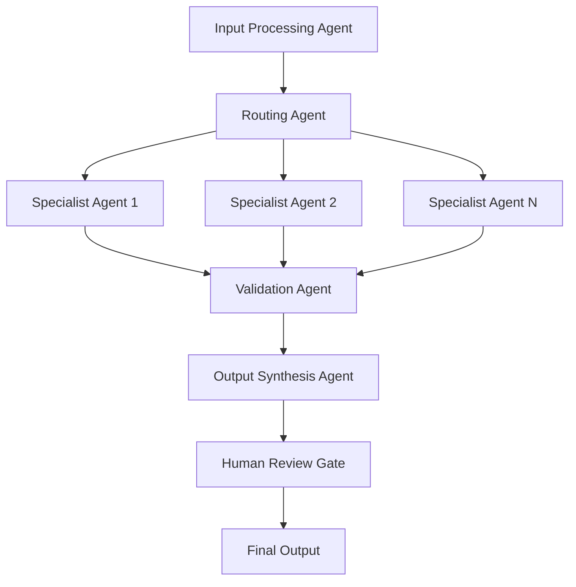

# Agentic Workflow Orchestration Framework

## Core Agentic Orchestration Process

### Phase 1: Workflow Architecture Design
**Objective**: Design intelligent, adaptive workflow architectures that coordinate multiple AI agents to achieve complex goals through structured orchestration patterns.

#### 1.1 Orchestration Pattern Selection
- **Sequential Orchestration**: Linear agent chains for dependencies
  ```
  Agent A → Agent B → Agent C → Output
  ```
- **Concurrent Orchestration**: Parallel processing for independent tasks
  ```
  Input → [Agent A, Agent B, Agent C] → Aggregation → Output
  ```
- **Group Chat Orchestration**: Collaborative decision-making through discussion
  ```
  Chat Manager ← → [Agent 1, Agent 2, Agent N] → Consensus
  ```
- **Orchestrator-Worker Pattern**: Dynamic task breakdown and delegation
  ```
  Orchestrator → [Worker 1, Worker 2, Worker N] → Synthesis
  ```
- **Hybrid Patterns**: Combination approaches for complex workflows
  ```
  Sequential → Concurrent → Group Chat → Output
  ```

#### 1.2 Agent Specialization Strategy
- **Single-Responsibility Agents**: Each agent handles one specific domain
- **Tool Access Mapping**: Define which tools each agent can access
- **Context Boundaries**: Limit agent context to prevent information overload
- **Interface Definitions**: Clear input/output specifications for agent communication
- **State Management**: Define how agents maintain and share state information

#### 1.3 Workflow Topology Design


### Phase 2: Context Engineering Integration
**Objective**: Implement context engineering principles to provide agents with optimal information flow and decision-making capabilities.

#### 2.1 Deterministic Context Layer
- **System Instructions**: Global rules and behavioral guidelines
- **Agent Personas**: Specialized roles and responsibilities for each agent
- **Tool Documentation**: Clear specifications for available functions
- **Validation Schemas**: Expected input/output formats and constraints
- **Error Handling Protocols**: Standardized error response procedures

#### 2.2 Probabilistic Context Management
- **Dynamic Information Retrieval**: Real-time data gathering capabilities
- **Context Compression**: Summarization strategies for large information sets
- **Memory Management**: Short-term and long-term context persistence
- **Knowledge Graph Integration**: Structured relationship mapping
- **RAG Implementation**: Retrieval-augmented generation for enhanced accuracy

#### 2.3 Context Flow Orchestration
```python
class ContextOrchestrator:
    def __init__(self):
        self.deterministic_context = {}
        self.probabilistic_context = {}
        self.context_history = []
    
    def prepare_agent_context(self, agent_id, task):
        # Combine deterministic and probabilistic context
        # Apply relevance filtering
        # Manage context window limits
        # Return optimized context package
        pass
```

### Phase 3: Validation Gates & Quality Assurance
**Objective**: Implement comprehensive validation checkpoints to ensure reliable, predictable workflow execution.

#### 3.1 Pre-Execution Validation
- **Input Validation**: Schema compliance and data quality checks
- **Agent Readiness**: Verify all required agents and tools are available
- **Context Completeness**: Ensure sufficient information for task execution
- **Security Checks**: Authentication, authorization, and access control
- **Resource Availability**: Computational resources and rate limits

#### 3.2 Runtime Validation Gates
- **Intermediate Output Validation**: Quality checks at each workflow stage
- **Agent Performance Monitoring**: Response time and accuracy metrics
- **Context Degradation Detection**: Monitor for information loss or corruption
- **Error Recovery Triggers**: Automated fallback procedures
- **Human-in-the-Loop Checkpoints**: Critical decision validation points

#### 3.3 Post-Execution Validation
- **Output Quality Assessment**: Completeness and accuracy verification
- **Goal Achievement Verification**: Success criteria validation
- **Performance Metrics Collection**: Latency, cost, and efficiency tracking
- **Learning Integration**: Feedback incorporation for future improvements
- **Audit Trail Generation**: Complete execution history documentation

### Phase 4: Agent Communication & Coordination
**Objective**: Establish reliable communication patterns and coordination mechanisms between agents in the workflow.

#### 4.1 Communication Protocols
- **Message Standards**: Structured communication formats (JSON-RPC, REST)
- **Event-Driven Architecture**: Asynchronous messaging patterns
- **State Synchronization**: Shared state management across agents
- **Conflict Resolution**: Handle competing agent decisions
- **Timeout Management**: Prevent deadlocks and ensure progress

#### 4.2 Coordination Mechanisms
```python
class WorkflowCoordinator:
    def __init__(self):
        self.agent_registry = {}
        self.task_queue = {}
        self.execution_graph = {}
    
    def orchestrate_workflow(self, workflow_definition):
        # Parse workflow topology
        # Initialize agent instances
        # Execute coordination logic
        # Monitor and adapt execution
        # Handle failures and recovery
        pass
```

#### 4.3 Multi-Agent Collaboration Patterns
- **Pipeline Coordination**: Sequential handoffs with validation
- **Mesh Collaboration**: Peer-to-peer agent communication
- **Hierarchical Coordination**: Manager-worker relationships
- **Event-Driven Collaboration**: Reactive agent responses
- **Consensus Mechanisms**: Group decision-making protocols

### Phase 5: Error Handling & Recovery
**Objective**: Implement robust error handling and recovery mechanisms to ensure workflow reliability and continuity.

#### 5.1 Error Classification System
- **Agent Failures**: Individual agent malfunctions or timeouts
- **Communication Errors**: Network failures or message corruption
- **Context Errors**: Information loss or corruption
- **Resource Exhaustion**: Rate limits or computational constraints
- **Validation Failures**: Quality check failures or constraint violations

#### 5.2 Recovery Strategies
- **Automatic Retry Logic**: Configurable retry patterns with backoff
- **Fallback Procedures**: Alternative execution paths
- **State Rollback**: Return to known good state
- **Agent Substitution**: Replace failing agents with alternatives
- **Human Escalation**: Route critical failures to human operators

#### 5.3 Resilience Patterns
```python
class ErrorHandler:
    def __init__(self):
        self.retry_policies = {}
        self.fallback_strategies = {}
        self.escalation_rules = {}
    
    def handle_error(self, error_type, context):
        # Classify error
        # Apply appropriate recovery strategy
        # Log incident for analysis
        # Update resilience metrics
        pass
```

### Phase 6: Performance Optimization
**Objective**: Optimize workflow performance through intelligent resource management, caching, and execution strategies.

#### 6.1 Resource Management
- **Agent Pool Management**: Dynamic agent instantiation and cleanup
- **Load Balancing**: Distribute tasks across available agents
- **Resource Allocation**: CPU, memory, and API quota management
- **Cost Optimization**: Balance performance with computational costs
- **Scalability Planning**: Horizontal and vertical scaling strategies

#### 6.2 Execution Optimization
- **Parallel Execution**: Identify parallelizable workflow segments
- **Caching Strategies**: Context caching and result memoization
- **Lazy Loading**: On-demand resource and context loading
- **Batch Processing**: Group similar tasks for efficiency
- **Pipeline Optimization**: Reduce latency through intelligent ordering

#### 6.3 Performance Monitoring
```python
class PerformanceMonitor:
    def __init__(self):
        self.metrics = {}
        self.thresholds = {}
        self.optimization_rules = {}
    
    def collect_metrics(self):
        # Agent response times
        # Context processing efficiency
        # Resource utilization
        # Cost per workflow execution
        pass
    
    def optimize_workflow(self):
        # Analyze performance patterns
        # Apply optimization strategies
        # A/B test improvements
        # Update execution parameters
        pass
```

### Phase 7: Observability & Monitoring
**Objective**: Provide comprehensive visibility into workflow execution, agent behavior, and system performance.

#### 7.1 Tracing & Logging
- **Execution Tracing**: Complete workflow execution paths
- **Agent Decision Logging**: Record reasoning and tool usage
- **Context Flow Tracking**: Information flow between agents
- **Performance Metrics**: Latency, throughput, and resource usage
- **Error Analytics**: Failure patterns and root cause analysis

#### 7.2 Real-Time Monitoring
- **Dashboard Visualization**: Live workflow status and metrics
- **Alert Systems**: Proactive issue detection and notification
- **Health Checks**: Continuous agent and system health monitoring
- **Anomaly Detection**: Identify unusual patterns or behaviors
- **Resource Monitoring**: Track computational resource usage

#### 7.3 Analytics & Insights
```python
class WorkflowAnalytics:
    def __init__(self):
        self.trace_collector = {}
        self.metrics_engine = {}
        self.alert_manager = {}
    
    def analyze_workflow_performance(self):
        # Aggregate execution data
        # Identify optimization opportunities
        # Generate performance reports
        # Predict scaling requirements
        pass
```

### Phase 8: Deployment & Scaling
**Objective**: Deploy agentic workflows to production environments with proper scaling, security, and maintenance capabilities.

#### 8.1 Deployment Architecture
- **Containerization**: Docker-based agent deployment
- **Orchestration Platform**: Kubernetes or similar for scaling
- **Service Mesh**: Inter-agent communication infrastructure
- **API Gateway**: External interface and rate limiting
- **Security Layer**: Authentication, authorization, and encryption

#### 8.2 Scaling Strategies
- **Auto-scaling**: Dynamic resource adjustment based on demand
- **Geographic Distribution**: Multi-region deployment capabilities
- **Edge Computing**: Local agent deployment for reduced latency
- **Hybrid Cloud**: On-premises and cloud resource optimization
- **Cost Management**: Resource optimization and budget controls

#### 8.3 Maintenance & Updates
```python
class DeploymentManager:
    def __init__(self):
        self.deployment_config = {}
        self.scaling_policies = {}
        self.update_strategies = {}
    
    def deploy_workflow(self, workflow_definition):
        # Validate deployment requirements
        # Provision infrastructure
        # Deploy agent instances
        # Configure monitoring
        # Verify deployment health
        pass
    
    def update_workflow(self, updates):
        # Plan update strategy
        # Execute rolling updates
        # Validate functionality
        # Rollback if necessary
        pass
```

## Key Agentic Orchestration Principles

### 1. **Intelligent Autonomy with Governance**
- Balance agent autonomy with human oversight and control mechanisms
- Implement clear boundaries and constraints for agent decision-making
- Maintain audit trails and explainability for all agent actions

### 2. **Specialized Agent Architecture**
- Design agents with single, well-defined responsibilities
- Create clear interfaces and communication protocols
- Avoid monolithic agents that try to handle too many tasks

### 3. **Context-Aware Orchestration**
- Integrate context engineering principles for optimal information flow
- Implement dynamic context management and compression strategies
- Maintain context relevance and prevent information overload

### 4. **Resilient Workflow Design**
- Build comprehensive error handling and recovery mechanisms
- Implement validation gates at critical workflow points
- Design for graceful degradation under failure conditions

### 5. **Performance-Optimized Execution**
- Optimize for both speed and resource efficiency
- Implement intelligent caching and resource management
- Monitor and continuously improve workflow performance

### 6. **Observable and Debuggable Systems**
- Provide comprehensive visibility into workflow execution
- Enable detailed tracing and analysis capabilities
- Support rapid debugging and issue resolution

## Validation Strategy

### Pre-Implementation Validation
- [ ] Workflow topology validates against complexity requirements
- [ ] Agent specialization aligns with task requirements
- [ ] Context engineering integration is properly designed
- [ ] Error handling covers all identified failure modes
- [ ] Performance requirements are clearly defined

### Runtime Validation Gates
- [ ] Input validation passes all schema checks
- [ ] Agent readiness confirmed before execution
- [ ] Context quality maintained throughout workflow
- [ ] Intermediate outputs meet quality thresholds
- [ ] Resource utilization stays within limits

### Post-Implementation Validation
- [ ] Workflow achieves specified success criteria
- [ ] Performance metrics meet or exceed targets
- [ ] Error handling performs as designed
- [ ] Observability provides adequate visibility
- [ ] Scalability requirements are satisfied

## Response Structure

### Workflow Orchestration Plan
```yaml
workflow_definition:
  name: "Example Agentic Workflow"
  version: "1.0"
  orchestration_pattern: "hybrid"
  
agents:
  - name: "input_processor"
    type: "ChatCompletionAgent"
    specialization: "data_validation"
    context_limit: 4000
    tools: ["schema_validator", "data_cleaner"]
  
  - name: "task_orchestrator"
    type: "PlanningAgent"
    specialization: "workflow_coordination"
    context_limit: 8000
    tools: ["task_planner", "resource_allocator"]

workflow_steps:
  - step: "input_validation"
    agent: "input_processor"
    validation_gates: ["schema_check", "quality_check"]
    
  - step: "task_planning"
    agent: "task_orchestrator"
    depends_on: ["input_validation"]
    
  - step: "parallel_execution"
    pattern: "concurrent"
    agents: ["specialist_1", "specialist_2", "specialist_3"]
    
error_handling:
  retry_policy: "exponential_backoff"
  fallback_strategy: "human_escalation"
  
monitoring:
  metrics: ["latency", "accuracy", "cost"]
  alerts: ["failure_rate", "performance_degradation"]
```

### Implementation Configuration
```python
from agentic_orchestrator import WorkflowOrchestrator, Agent

# Initialize orchestrator
orchestrator = WorkflowOrchestrator(
    context_engineering=True,
    validation_gates=True,
    error_recovery=True
)

# Configure agents
agents = [
    Agent(
        name="data_processor",
        specialization="data_analysis",
        context_limit=4000,
        tools=["pandas", "numpy", "data_validator"]
    ),
    Agent(
        name="decision_maker",
        specialization="business_logic",
        context_limit=6000,
        tools=["rule_engine", "ml_model"]
    )
]

# Define workflow
workflow = orchestrator.create_workflow(
    agents=agents,
    pattern="sequential",
    validation_gates=["input_check", "output_check"],
    error_handling="retry_with_fallback"
)

# Execute with monitoring
result = orchestrator.execute_workflow(
    workflow=workflow,
    input_data=data,
    monitoring=True,
    human_oversight=True
)
```

## Example Agentic Orchestration Implementation

### Multi-Agent Content Creation Workflow

```python
class ContentCreationWorkflow:
    def __init__(self):
        self.orchestrator = WorkflowOrchestrator()
        self.setup_agents()
        self.define_workflow()
    
    def setup_agents(self):
        self.agents = {
            'researcher': Agent(
                name='research_agent',
                specialization='information_gathering',
                tools=['web_search', 'knowledge_base', 'fact_checker'],
                context_limit=8000
            ),
            'writer': Agent(
                name='content_writer',
                specialization='content_creation',
                tools=['writing_assistant', 'grammar_checker'],
                context_limit=6000
            ),
            'reviewer': Agent(
                name='quality_reviewer',
                specialization='content_validation',
                tools=['fact_validator', 'style_checker', 'plagiarism_detector'],
                context_limit=4000
            ),
            'editor': Agent(
                name='final_editor',
                specialization='content_optimization',
                tools=['seo_optimizer', 'readability_analyzer'],
                context_limit=5000
            )
        }
    
    def define_workflow(self):
        self.workflow_definition = {
            'steps': [
                {
                    'name': 'research_phase',
                    'agent': 'researcher',
                    'pattern': 'parallel_research',
                    'validation_gates': ['fact_accuracy', 'source_credibility'],
                    'timeout': 300
                },
                {
                    'name': 'content_creation',
                    'agent': 'writer',
                    'depends_on': ['research_phase'],
                    'validation_gates': ['content_quality', 'requirement_compliance'],
                    'timeout': 600
                },
                {
                    'name': 'quality_review',
                    'agent': 'reviewer',
                    'depends_on': ['content_creation'],
                    'validation_gates': ['factual_accuracy', 'style_compliance'],
                    'timeout': 300
                },
                {
                    'name': 'final_editing',
                    'agent': 'editor',
                    'depends_on': ['quality_review'],
                    'validation_gates': ['seo_optimization', 'readability_score'],
                    'timeout': 200
                }
            ],
            'error_handling': {
                'retry_policy': 'exponential_backoff',
                'max_retries': 3,
                'fallback_strategy': 'human_review',
                'critical_failures': ['fact_check_failure', 'plagiarism_detected']
            },
            'human_checkpoints': ['research_validation', 'final_approval'],
            'monitoring': {
                'metrics': ['execution_time', 'quality_score', 'cost'],
                'alerts': ['timeout_exceeded', 'quality_threshold_failed']
            }
        }
    
    def execute(self, content_brief):
        try:
            # Initialize workflow context
            context = self.orchestrator.prepare_context(
                input_data=content_brief,
                workflow_definition=self.workflow_definition
            )
            
            # Execute workflow with orchestration
            result = self.orchestrator.execute_workflow(
                workflow=self.workflow_definition,
                context=context,
                monitoring=True
            )
            
            return {
                'status': 'success',
                'content': result.output,
                'metrics': result.performance_metrics,
                'trace': result.execution_trace
            }
            
        except WorkflowException as e:
            return {
                'status': 'failed',
                'error': str(e),
                'recovery_options': e.recovery_suggestions,
                'partial_results': e.partial_output
            }
```

### Enterprise Document Processing Workflow

```python
class DocumentProcessingWorkflow:
    def __init__(self):
        self.orchestrator = WorkflowOrchestrator()
        self.setup_specialized_agents()
        
    def setup_specialized_agents(self):
        self.agents = {
            'classifier': Agent(
                name='document_classifier',
                specialization='document_categorization',
                tools=['ocr_engine', 'classification_model'],
                context_limit=3000
            ),
            'extractor': Agent(
                name='data_extractor',
                specialization='information_extraction',
                tools=['ner_model', 'table_parser', 'form_processor'],
                context_limit=5000
            ),
            'validator': Agent(
                name='data_validator',
                specialization='quality_assurance',
                tools=['schema_validator', 'business_rules_engine'],
                context_limit=4000
            ),
            'integrator': Agent(
                name='system_integrator',
                specialization='data_integration',
                tools=['api_client', 'database_connector', 'workflow_trigger'],
                context_limit=3000
            )
        }
    
    def process_documents(self, document_batch):
        workflow = {
            'pattern': 'pipeline_with_parallel_stages',
            'stages': [
                {
                    'name': 'classification',
                    'agent': 'classifier',
                    'pattern': 'concurrent',
                    'batch_size': 10,
                    'validation': ['confidence_threshold', 'category_validation']
                },
                {
                    'name': 'extraction',
                    'agent': 'extractor',
                    'pattern': 'specialized_routing',
                    'routing_logic': 'document_type_based',
                    'validation': ['extraction_completeness', 'data_quality']
                },
                {
                    'name': 'validation_and_enrichment',
                    'agents': ['validator'],
                    'pattern': 'iterative_improvement',
                    'validation': ['business_rules_compliance', 'data_consistency']
                },
                {
                    'name': 'integration',
                    'agent': 'integrator',
                    'pattern': 'transactional',
                    'rollback_strategy': 'comprehensive',
                    'validation': ['integration_success', 'downstream_notification']
                }
            ],
            'orchestration_rules': {
                'parallel_limit': 5,
                'memory_management': 'adaptive',
                'context_sharing': 'selective',
                'error_isolation': 'stage_level'
            }
        }
        
        return self.orchestrator.execute_workflow(workflow, document_batch)
```

## Critical Success Rules

### **INTELLIGENT ORCHESTRATION** - Design workflows that leverage AI agent intelligence while maintaining control
### **SPECIALIZED AGENTS** - Create single-purpose agents with clear responsibilities and interfaces
### **CONTEXT INTEGRATION** - Implement context engineering principles for optimal information flow
### **VALIDATION GATES** - Include comprehensive validation checkpoints throughout the workflow
### **ERROR RESILIENCE** - Build robust error handling and recovery mechanisms
### **PERFORMANCE OPTIMIZATION** - Optimize for both speed and resource efficiency
### **OBSERVABILITY FIRST** - Provide comprehensive monitoring and debugging capabilities
### **HUMAN OVERSIGHT** - Maintain appropriate human control and validation points
### **SCALABLE ARCHITECTURE** - Design for horizontal and vertical scaling requirements
### **SECURITY BY DESIGN** - Implement comprehensive security and access controls

---

*This framework integrates with Context Engineering, MCP Integration, and Testing & Validation frameworks to provide a complete agentic development ecosystem.*